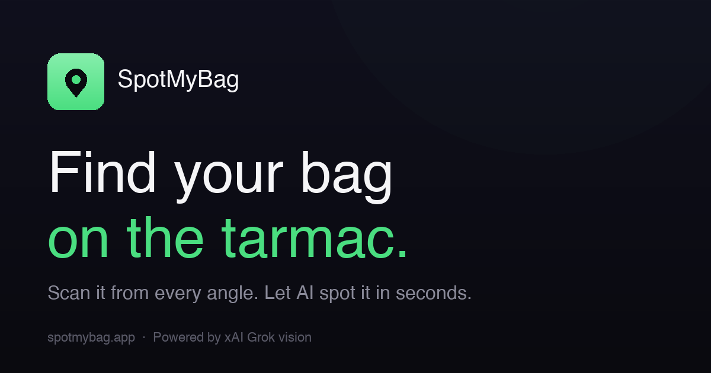

<div align="center">



# SpotMyBag

**Find your bag in the luggage pile on the tarmac. AI-powered, in seconds.**

[**→ Live demo**](https://spotmybag.vercel.app) &nbsp;·&nbsp; [Report an issue](https://github.com/apraba05/spot-my-bag/issues)

</div>

---

## What is this?

You land. Your gate-checked carry-on is sitting on the tarmac in a sea of forty other identical black suitcases. You're tired. The flight attendant gives a vague hand wave.

SpotMyBag is a mobile web app that uses [xAI Grok vision](https://x.ai) to find your specific bag in the pile. You scan your bag from a few angles with your phone camera, snap one wide photo of the luggage on the tarmac, and the app returns:

- **Where** your bag is in the pile (e.g., *"center-right of the pile, second row from the front"*)
- A glowing **targeting reticle** drawn on the photo at the matched location
- A list of features the AI **matched** (color, shape, ribbon, brand markings, etc.)
- A confidence **stamp**: `CONFIRMED` / `PROBABLE` / `UNCERTAIN`

The result is presented as a boarding pass. Because you're at the airport.

## Try it

**Free, no signup:** [spotmybag.vercel.app](https://spotmybag.vercel.app)

The hosted version uses a shared xAI key with a 15-request-per-hour rate limit per IP. Drop your own xAI key in settings (gear icon, top-right) to skip the limit and bill usage to your own account.

For a first try:
1. Place your bag somewhere photographable
2. Tap **Start 360° scan** and walk around your bag, capturing 4–8 angles
3. Tap **Photograph the pile** and frame the luggage pile (real or staged)
4. Optionally add flight info (airline / flight # / arrival code)
5. Tap **Initiate Search**

Works in any modern mobile browser. Installable as a PWA from iOS Safari (Share → Add to Home Screen) or Android Chrome (install prompt).

## How it works

1. **360° reference scan** — User captures up to 8 photos of their bag from different angles using the in-app camera (live `getUserMedia` viewfinder, shutter button, progress dots, capture-to-strip preview).
2. **Pile photo** — One wide photo of the luggage pile.
3. **Client-side compression** — Images are downscaled to ~1600px JPEG @ 0.82 quality before upload.
4. **Server-side proxy** (`/api/spot`) — A Vercel Function validates the payload (1–8 reference images, ≤1.5MB each, ≤10MB total), rate-limits per IP, then calls xAI with the images and a structured prompt.
5. **Grok vision** — `grok-4-fast-non-reasoning` returns minified JSON with `location`, `matched[]`, `confidence`, `notes`, and a `bbox` (as percentages of the pile image).
6. **Annotated result** — The client overlays a glowing teal targeting reticle on the pile photo at the returned coordinates, presented inside a boarding-pass-style result card with a perforated stub and barcode.

## Stack

- Pure vanilla **HTML / CSS / JS** — no framework, no build step
- A single `index.html` (~80KB) for the entire client
- **Vercel Functions** (Node.js) for the xAI proxy
- **Vercel Web Analytics** (anonymous pageviews)
- **Inter** + **JetBrains Mono** via Google Fonts
- **PWA** — service worker + manifest for installable home-screen experience
- **xAI Grok vision** (`grok-4-fast-non-reasoning`)

No `package.json`. No node_modules. No bundler. Just files.

## Self-host

```bash
# 1. Clone
git clone https://github.com/apraba05/spot-my-bag.git
cd spot-my-bag

# 2. Get an xAI API key at https://console.x.ai

# 3. Link & deploy to Vercel (creates the project)
npx vercel deploy --prod

# 4. Set the env var (paste key when prompted, or pipe in)
npx vercel env add XAI_API_KEY production

# 5. Re-deploy so the function picks up the env var
npx vercel deploy --prod
```

Vercel auto-detects this as a static site with serverless functions in `/api`. No further config needed.

### Local dev

```bash
# Static server (camera will not work over plain HTTP — only on localhost or HTTPS)
python3 -m http.server 8787
# → http://localhost:8787
```

To run the API locally, use `vercel dev` instead — it spins up the function and the static server together at `http://localhost:3000`.

## Project structure

```
.
├── api/
│   └── spot.js           # Vercel Function — xAI proxy + rate limit + validation
├── index.html            # The entire app — UI, camera, state, API client
├── sw.js                 # Service worker (offline app shell)
├── manifest.json         # PWA manifest
├── vercel.json           # Headers (cache, perms-policy, content-type-options)
├── og.png                # Open Graph social card (1200×630)
├── apple-touch-icon.png  # iOS home-screen icon (180×180)
├── icon-192.png          # PWA icon
├── icon-512.png          # PWA icon
├── icon-512-maskable.png # PWA maskable icon
├── favicon-32.png        # Browser favicon
└── README.md
```

## Privacy

- Photos are sent only to xAI via the server-side proxy. Per [xAI's policy](https://x.ai/legal/privacy-policy), API inputs are not used for training.
- No accounts, no user tracking. Vercel Web Analytics records anonymous pageview counts only.
- Your optional xAI key (if you set one in the gear-icon menu) is stored in `localStorage` on your device only — never sent anywhere except directly to xAI.
- Flight info (airline / flight # / arrival), if entered, is sent to Grok as text context for the search and stored in `localStorage` for convenience.

## Customization

Common tweaks if you self-host:

| Setting | Where | Default |
|---|---|---|
| Vision model | `api/spot.js` → `model` | `grok-4-fast-non-reasoning` |
| Rate limit per IP | `api/spot.js` → `RATE_LIMIT` | 15/hour |
| Max reference images | `api/spot.js` → `MAX_BAG_IMAGES` | 8 |
| Per-image size cap | `api/spot.js` → `MAX_DATA_URL_BYTES` | 1.5 MB |
| Client compression target | `index.html` → `COMPRESS_MAX_DIM` | 1600 px |
| Min angles to enable "Done" | `index.html` → `SCAN_MIN` | 4 |

For production-grade rate limiting that survives across function instances, swap the in-memory `Map` in `api/spot.js` for [`@upstash/ratelimit`](https://github.com/upstash/ratelimit) backed by Upstash Redis.

## Roadmap

- [ ] Multi-bag mode for couples / families
- [ ] Local search history
- [ ] Cross-instance rate limiting (Upstash Redis)
- [ ] Custom domain
- [ ] Camera tap-to-focus on the live preview

## License

[MIT](./LICENSE) © Ashan Praba
